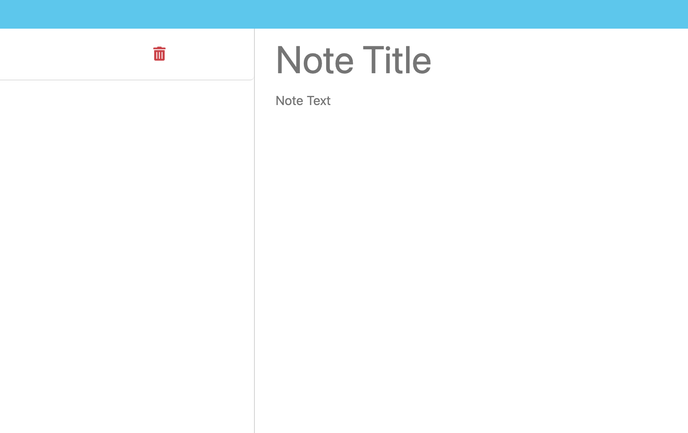

# 1. My-Express-Note-Taker

### Welcome to a Note taker application using Express.js

# Description

### This note taker website is like no other because in this project we are implementing Express.js as the language or Node.js framework to create communication between the front-end and back-end. With Express we are not just using apis routes but creating them.

# 2. User Story

GIVEN a note-taking application
WHEN I open the Note Taker
THEN I am presented with a landing page with a link to a notes page
WHEN I click on the link to the notes page
THEN I am presented with a page with existing notes listed in the left-hand column, plus empty fields to enter a new note title and the note’s text in the right-hand column
WHEN I enter a new note title and the note’s text
THEN a "Save Note" button and a "Clear Form" button appear in the navigation at the top of the page
WHEN I click on the Save button
THEN the new note I have entered is saved and appears in the left-hand column with the other existing notes and the buttons in the navigation disappear
WHEN I click on an existing note in the list in the left-hand column
THEN that note appears in the right-hand column and a "New Note" button appears in the navigation
WHEN I click on the "New Note" button in the navigation at the top of the page
THEN I am presented with empty fields to enter a new note title and the note’s text in the right-hand column and the button disappears

# 3. How to Use

### In order to run this website we need to use node commands. Because Express.js is a Node.js framework the command we will be using is node followed by the file in this case server.js directly from the terminal. On the terminal youll see a port number displayed. This will indicate the user that the front and backend is connected. Now we can type http://localhost/:5500 on the browser.

# 4. Deployment

### https://github.com/jesse437/My-Express-Note-Taker

# 5. Visuals

# 6. Collaborators

### [Jesus Ruiz Gutierrez](https://github.com/jesse437)

# 7. Technologies Used

- Express.js
